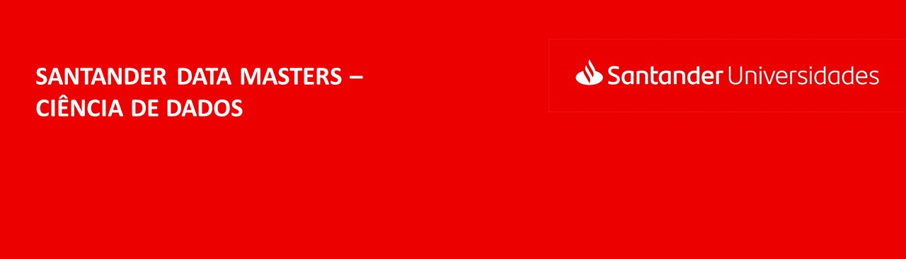

<!--
*** Thanks for checking out this README Template. If you have a suggestion that would
*** make this better, please fork the repo and create a pull request or simply open
*** an issue with the tag "enhancement".
*** Thanks again! Now go create something AMAZING! :D
***
***
***
*** To avoid retyping too much info. Do a search and replace for the following:
*** , repo_name, twitter_handle, email
-->

<!-- PROJECT SHIELDS -->
<!--
*** I'm using markdown "reference style" links for readability.
*** Reference links are enclosed in brackets [ ] instead of parentheses ( ).
*** See the bottom of this document for the declaration of the reference variables
*** for contributors-url, forks-url, etc. This is an optional, concise syntax you may use.
*** https://www.markdownguide.org/basic-syntax/#reference-style-links
-->
[![LinkedIn][linkedin-shield]][linkedin-url]

<!-- PROJECT LOGO -->
 

  

  <h3 align="center">SANTANDER DATA MASTERS CASE</h3>

  

    This project was made as part of the mentorship program that I received for winning the Data Masters Program of Santander Bank
     
  

<!-- TABLE OF CONTENTS -->
## Table of Contents

* [About the Project](#about-the-project)
  * [The Program](#the-program)
  * [Competition](#competition)
  * [Learning](#learning)
  * [Case Introduction](#case-introduction)
  * [Part A: Classification](part-a-classification)
  * [Part B:](#part-b)
  * [Part C: Clustering](#part-c-clustering)
* [Roadmap](#roadmap)
* [License](#license)
* [Contact](#contact)
* [Acknowledgements](#acknowledgements)

<!-- ABOUT THE PROJECT -->
## About The Project

The Santander group is a global banking group, led by Banco Santander S.A., the largest bank in the euro area. It has its origin in Santander, Cantabria, Spain.
As part of their empowerment culture, they create the Data Master program.

### The Program

Santander Data Masters - Data Science is a teaching and certification program provided by the corporate university of Academia Santander.
The program consists of a mix of training and competition, where Santander University provides content and selects the best participants.

### Competition
The program has 3 evaluation phases, which are:

* Phase 1: the candidates must take the Cultural Fit, General Knowledge and Logic Reasoning assessments. In this phase, there were about 3200 candidates and only 100 were selected.

* Phase 2: the candidates have 33 days to study all material selected by Santander Academy. In the end, there was a technical assessment and it is needed a performance over 50% to get certified.

* Phase 3: the top 3 participants receive the opportunity to do a Project provided by Santander as well as a mentorship session with Santander staff.

### Learning
After selecting the 100 participants, the academy provided structured teaching material covering the most important knowledge and skills that a data scientist should have. The following topics were addressed:

*  Probability and Statistics: from basics to advanced concepts;
*  SQL and NoSQL;
*  Big Data concepts and applications;
*  Programming;
*  Regression: Linear, Multiple, Ridge & Lasso, Variable Selection
*  Classification: Logistic Regression, Decision Tree, Random Forest and Naive Bayes;
*  Clustering: K-means, Hierarchical Clustering (divisive and agglomerative), Latent Dirichlet Allocation;
*  Performance Metrics.

### Case Introduction
* 

### Part A: Classification
* 

### Part B:
* 

### Part C: Clustering
* 

### Built With

* 
* 
* 

<!-- ROADMAP -->
## Roadmap

See the [open issues](https://github.com/PedroHCouto/Santander-Case/issues) for a list of proposed features (and known issues).

<!-- LICENSE -->
## License

Distributed under the MIT License. See `LICENSE` for more information.

<!-- CONTACT -->
## Contact

Your Name - [@twitter_handle](https://twitter.com/twitter_handle) - email

Project Link: [https://github.com/PedroHCouto/Santander-Case](https://github.com/PedroHCouto/Santander-Case)

<!-- ACKNOWLEDGEMENTS -->
## Acknowledgements

* 
* 
* 

<!-- MARKDOWN LINKS & IMAGES -->
<!-- https://www.markdownguide.org/basic-syntax/#reference-style-links -->
[contributors-shield]: https://img.shields.io/github/contributors/othneildrew/Best-README-Template.svg?style=flat-square
[contributors-url]: https://github.com/othneildrew/Best-README-Template/graphs/contributors
[forks-shield]: https://img.shields.io/github/forks/othneildrew/Best-README-Template.svg?style=flat-square
[forks-url]: https://github.com/othneildrew/Best-README-Template/network/members
[stars-shield]: https://img.shields.io/github/stars/othneildrew/Best-README-Template.svg?style=flat-square
[stars-url]: https://github.com/othneildrew/Best-README-Template/stargazers
[issues-shield]: https://img.shields.io/github/issues/othneildrew/Best-README-Template.svg?style=flat-square
[issues-url]: https://github.com/othneildrew/Best-README-Template/issues
[license-shield]: https://img.shields.io/github/license/othneildrew/Best-README-Template.svg?style=flat-square
[license-url]: https://github.com/othneildrew/Best-README-Template/blob/master/LICENSE.txt
[linkedin-shield]: https://img.shields.io/badge/-LinkedIn-black.svg?style=flat-square&logo=linkedin&colorB=555
[linkedin-url]: https://www.linkedin.com/in/pedrocouto39/?locale=en_US
[product-screenshot]: images/screenshot.png
